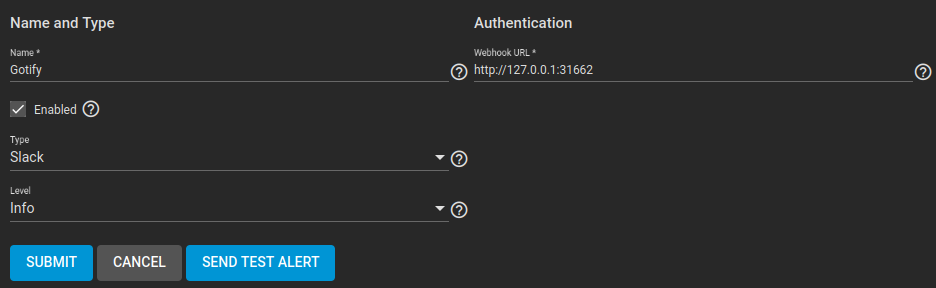

# TrueNAS Gotify Adapter (Golang)

***Ported to Go from [ZTube's TrueNas Gotify Adapter](https://github.com/ZTube/truenas-gotify-adapter/tree/main)***

This program uses TrueNAS CORE's built-in Slack alert service to send notifications to a [Gin-powered HTTP server](https://github.com/gin-gonic/gin) that exposes a Webhook endpoint.  As far as TrueNAS knows, it's just Slack on the other end.

> **NOTE**: Slack is not necessary to run this program and is not used for anything in this guide.

## Setup

### 1: Generate Gotify Token

Open Gotify and go to APPS -> Create Application

Give the app whatever name and description you want.  I went with TrueNAS.


After creating the app you can retrieve the token by clicking the eye icon.


### 2: Start TrueNAS Gotify Adapter Container

The program can be run on its own in Docker (or whatever container engine you prefer).  Personally I run it as a pod inside a local Kubernetes cluster ([my manifests here](kubernetes-manifests/readme.md)).

#### Environment Variables

| Name | Description | example value |
| --- | --- | --- |
| `GOTIFY_URL` | The Gotify URL to forward the alert to (make sure to include the **/message** suffix) | gotify.local/message  |
| `GOTIFY_TOKEN` | The Gotify application token you created earlier | \<token> |
| `LISTEN_HOST` | The IP address this program listens on | 0.0.0.0 |
| `LISTEN_PORT` | The port this program listens on | 31662 |

#### Example `docker run` command

```bash
docker run -d \
  -e GOTIFY_URL="http://gotify.local" \
  -e GOTIFY_TOKEN="your-token-here" \
  -e LISTEN_HOST="0.0.0.0" \
  -e LISTEN_PORT="31662" \
  -p 31662:31662 \
  jwschman/truenas-gotify:main
```

> **NOTE**: Replace environment variables with your values, or use a `.env` file if you prefer.  You can copy and rename the `.env.example` from this repo to `.env` and edit the values as needed.

### 3: Add Alert Service to TrueNAS

In TrueNAS CORE go to System->Alert Services->ADD

Set the name to whatever you want (e.g., Gotify) and the Type to **Slack**.  You can also change the alert level.  *Info* is a good choice if you want to receive all alerts.  In **Webhook URL** you'll enter the full URL and port of the endpoint for the running container.

> **NOTE**: You can run the adapter behind a reverse proxy and use the FQDN here if you want



After that's input you can click **SEND TEST ALERT** and hopefully see that it was sent successfully.  If it was, click **SUBMIT** and you're set up.  Head over to your Gotify page and see your test alert TrueNAS just sent.


That's it.  You're good to go 😎

## TODO

- Checks for if environment variables are set
- Builtin default values for LISTEN_HOST and LISTEN_PORT if not supplied
- Add checks if GOTIFY_URL is correct
- Add tags to images

But honestly it's kind of fine how it is.

## About

I created this program as a coding exercise after finding the original script by [ZTube](https://github.com/ZTube).  I've been centralizing my notifications into Gotify and wanted to get my TrueNAS notifications there as well, and of course there isn't native Gotify support in TrueNAS.  When I googled "truenas notifications in gotify" I found [this python script](https://github.com/ZTube/truenas-gotify-adapter/tree/main) which did exactly what I wanted.

It's great, but it also made me want to try some go programming again and see if I could rewrite it myself.  So that's what I did and here we are.

It was also a chance for me to use [Gin](https://github.com/gin-gonic/gin) some more and learn how to use GitHub Actions to push custom images to Docker Hub.

## References

- [Truenas Gotify Adapter](https://github.com/ZTube/truenas-gotify-adapter/tree/main) - Original python script by ZTube
- [Gin Reference Pages](<https://pkg.go.dev/github.com/gin-gonic/gin#section-readme>)
- [Introduction to GitHub Actions with Docker](https://docs.docker.com/guides/gha/)
- [Build CI/CD pipelines in Go with github actions and Docker](https://dev.to/gopher/build-ci-cd-pipelines-in-go-with-github-actions-and-dockers-1ko7)

## License

Like the original, all software in this repo is released to the public domain under the [unlicense](https://unlicense.org/).
